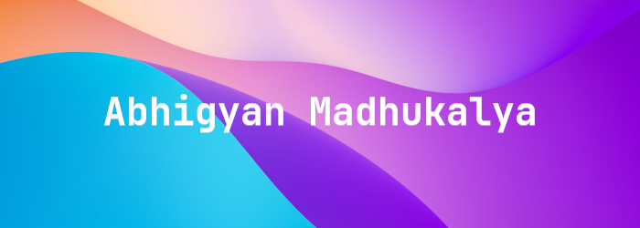

```
# 皆さん、こんにちは! 👋
```
---

## Somethings about me
- 🖋️ Ist Year Student at [Assam Engineering College](https://aec.ac.in) (Instrumentation Engineering)
- 💬 Ask me about **Go**, **Git** and **Python**.
- 🔭 Currently relearning **C**.

---

<!--START_SECTION:waka-->

```txt
From: 06 July 2022 - To: 03 December 2024

Total Time: 253 hrs 56 mins

Python       51 hrs 54 mins  █████░░░░░░░░░░░░░░░░░░░░   20.44 %
Lua          43 hrs 2 mins   ████▒░░░░░░░░░░░░░░░░░░░░   16.95 %
Markdown     16 hrs 10 mins  █▓░░░░░░░░░░░░░░░░░░░░░░░   06.37 %
C            14 hrs 40 mins  █▒░░░░░░░░░░░░░░░░░░░░░░░   05.78 %
JavaScript   13 hrs 57 mins  █▒░░░░░░░░░░░░░░░░░░░░░░░   05.50 %
Bash         13 hrs 3 mins   █▒░░░░░░░░░░░░░░░░░░░░░░░   05.14 %
conf         9 hrs 46 mins   █░░░░░░░░░░░░░░░░░░░░░░░░   03.85 %
Other        9 hrs 44 mins   █░░░░░░░░░░░░░░░░░░░░░░░░   03.84 %
HTML         9 hrs 11 mins   █░░░░░░░░░░░░░░░░░░░░░░░░   03.62 %
Go           8 hrs 30 mins   █░░░░░░░░░░░░░░░░░░░░░░░░   03.35 %
```

<!--END_SECTION:waka-->

---

📪 Socials :<br>
[E-Mail](mailto:abhigyanmadhukalya@gmail.com) | <a rel="me" href="https://mastodon.social/@abhigyanmadhukalya">Mastodon</a> | [LinkedIn](https://www.linkedin.com/in/abhigyanmadhukalya000/)

🧰 Tools :<br>
[Visual Studio Code](https://code.visualstudio.com/) | [WSL](https://learn.microsoft.com/en-us/windows/wsl/) | [Wezterm](https://wezfurlong.org/wezterm/index.html) | [Git](https://git-scm.com/) | [Todoist](https://todoist.com)

⌨️ Languages :<br>
[Python](https://python.org) | [C](https://www.iso.org/standard/74528.html) | [HTML](https://html.spec.whatwg.org/) | [CSS](https://www.w3.org/Style/CSS/Overview.en.html) | [MySQL](https://www.mysql.com/) | [Bash Scripting](https://www.gnu.org/software/bash/) | [Go](https://go.dev)

---

## Some recent activity from me
<p align="center">
  
  
</p>

